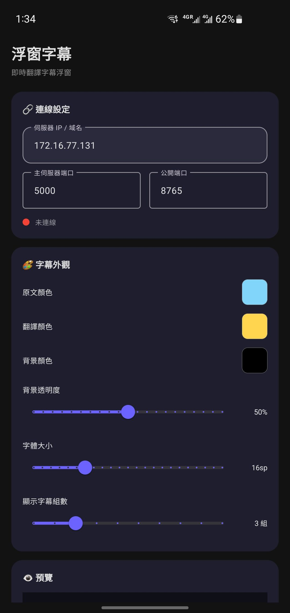
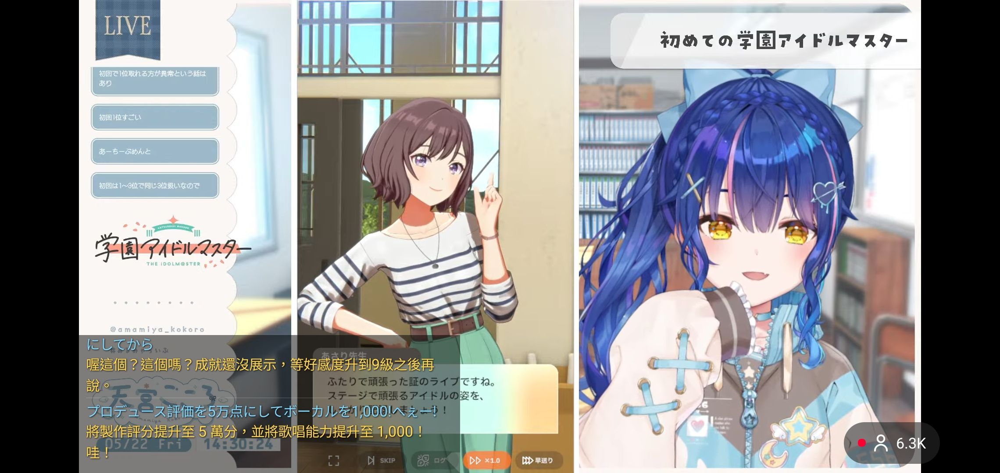

# 浮窗字幕 SubtitleOverlay

Android 即時翻譯字幕浮窗應用程式，透過 SSE (Server-Sent Events) 接收翻譯伺服器的即時字幕串流，以系統級浮窗覆蓋在其他 App 上方顯示。

> 本專案需搭配 [stream-translator-gpt-floatwindow-ui](https://github.com/SakurajimaMai-1202/stream-translator-gpt-floatwindow-ui) 使用。

## 效果展示

<p align="center">
  
  &nbsp;&nbsp;&nbsp;&nbsp;
  
</p>

## 功能特色

### 核心功能
- 🔗 **SSE 即時字幕串流** — 自動偵測翻譯任務、解析 subtitle/status/error/ping 事件
- 📱 **系統浮窗** — `TYPE_APPLICATION_OVERLAY`，覆蓋在其他 App 上方
- 📝 **多行字幕** — 原文 + 翻譯同時顯示，可自訂保留組數（1-10 組）
- 🔄 **自動重連** — 斷線後以指數退避方式自動重連
- 🔔 **前景服務** — 常駐通知，不會被系統殺掉

### 自訂功能
- 🎨 原文 / 翻譯文字顏色（色盤 + Hex 色碼）
- 🖌️ 背景顏色與透明度（0-100%）
- 🔤 字體大小（10-32sp）
- 📋 內建偵錯日誌面板

### 浮窗操作
- ✋ **拖曳移動** — 觸控中央區域拖曳
- ↔️ **調整大小** — 拖曳邊緣（PiP 風格），四邊＋四角均可
- 💾 **尺寸記憶** — 調整後自動儲存

## 系統需求

- Android 8.0 (API 26) 以上
- 需授予「顯示在其他應用程式上層」權限

## 連線設定

應用程式透過以下流程與翻譯伺服器對接：

1. `GET /api/server/info` → 取得公開端口與分享狀態
2. `GET /api/translation/active-task` → 取得當前翻譯任務 ID
3. `GET /api/translation/stream/{task_id}` → SSE 即時字幕串流

### 設定項目

| 項目 | 說明 | 預設值 |
|------|------|--------|
| 伺服器 IP / 域名 | 翻譯伺服器位址 | `192.168.1.100` |
| 主伺服器端口 | stream-translator-gpt 主服務端口 | `5000` |
| 公開端口 | 字幕分享端口 | `8765` |

## 使用方式

1. 從 [Releases](https://github.com/W-Nana/SubtitleOverlay/releases) 下載 APK
2. 安裝到 Android 裝置
3. 授予「顯示在其他應用程式上層」(懸浮窗) 權限
4. 輸入翻譯伺服器的 IP 和端口
5. 調整字幕外觀設定
6. 點擊「啟動浮窗字幕」
7. 切換到其他 App，字幕會以浮窗形式覆蓋顯示

## 建置

```bash
# 編譯 Debug APK
./gradlew assembleDebug

# 編譯 Release APK（需設定簽名）
./gradlew assembleRelease
```

**環境需求：**
- Java 17+
- Android SDK (compileSdk 34)

## 技術細節

| 項目 | 內容 |
|------|------|
| 語言 | Kotlin |
| 最低版本 | Android 8.0 (API 26) |
| 目標版本 | Android 14 (API 34) |
| 網路 | OkHttp 4.12.0 (手動解析 SSE) |
| UI | Material Design 3 |
| 架構 | LifecycleService + WindowManager |

## 授權

MIT License
